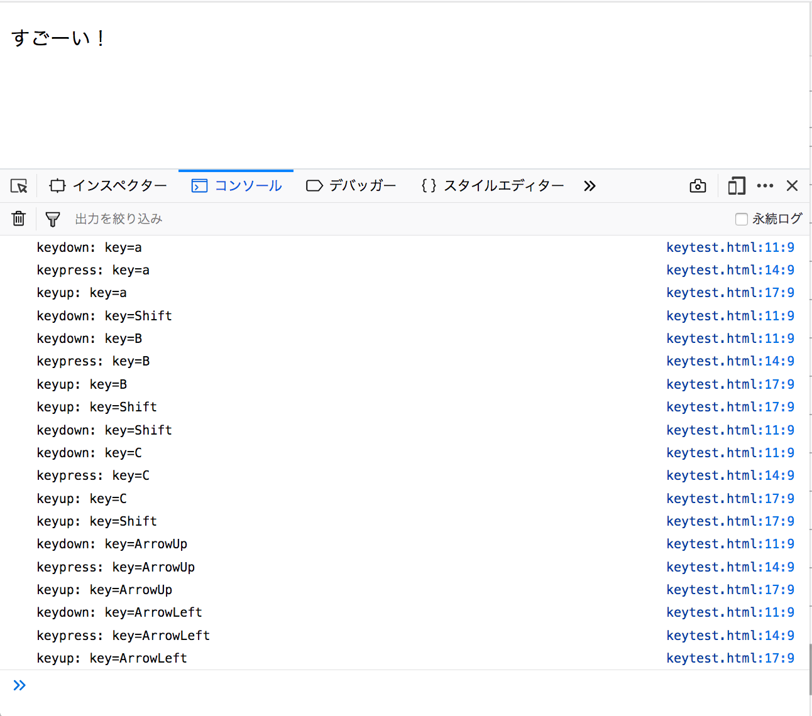

# イベント

ユーザーがWebページに対して何か操作した時に、JavaScriptで処理を実行できると便利です。
そのために、イベントという仕組みが提供されています。

まず、捕捉したいイベントの名前と、イベントが発生した時に実行される関数（イベントハンドラー）を登録します。

イベントハンドラーを登録するには、イベントを捕捉する対象に関して addEventListener メソッドを呼びます。
最初の引数はイベント名、第2引数はイベントハンドラーで、第3引数（省略可能）は通常は false を指定します。

## click イベント

例として、ページ上でのマウスのクリックを捕捉してみましょう。
イベント名は `click`、イベントを捕捉する対象は `window` とします。
```html
<!DOCTYPE HTML>
<html>
  <head>
    <meta charset="utf-8">
    <title>すごいWebページ</title>
  </head>
  <body>
    <p id="sugoi">すごーい！</p>
    <script>
      let onclick_handler = () => {
        console.log(`clicked!`);
      };
      window.addEventListener("click", onclick_handler, false);
    </script>
  </body>
</html>
```

ページをクリックした時に、コンソールに clicked! と表示されれば成功です。

イベントハンドラーには引数としてイベントオブジェクトが渡されます。
イベントオブジェクトからは、発生したイベントに関するより詳しい情報を取得できます。
例えば、 click イベントに関するイベントオブジェクトからは、マウスをクリックした位置を取得できます（`clientX`, `cilentY` プロパティー）。

さっき書いたコード（`<script>` の中身）を、次のように書き換えてみましょう：
```javascript
let onclick_handler = (event) => {
    console.log(`clicked! x:${event.clientX} y:${event.clientY}`);
};
window.addEventListener("click", onclick_handler, false);
```

クリックする位置によって、表示される数字が変わることがわかるでしょうか？

問題：click イベントのイベントオブジェクトの、 `clientX` と `clientY` プロパティーの原点はどこか。座標軸はどの向きか。

clickイベントのイベントオブジェクトは `MouseEvent` と呼ばれる種類のオブジェクトです。
詳細については、[MDN](https://developer.mozilla.org/ja/docs/Web/API/MouseEvent)を参照してください。

## キー入力

キーの押下を処理したい場合は、 keydown, keypress, keyup などのイベントを捕捉します。押されたキーの情報は、イベントオブジェクトの `key` プロパティーで取得できます。

例として、押されたキーの情報をJavaScriptコンソールに書き出してみましょう。

```html
<!DOCTYPE HTML>
<html>
  <head>
    <meta charset="utf-8">
    <title>すごいWebページ</title>
  </head>
  <body>
    <p id="sugoi">すごーい！</p>
    <script>
      let keydown_handler = (event) => {
        console.log(`keydown: key=${event.key}`);
      };
      let keypress_handler = (event) => {
        console.log(`keypress: key=${event.key}`);
      };
      let keyup_handler = (event) => {
        console.log(`keyup: key=${event.key}`);
      };
      window.addEventListener("keydown", keydown_handler, false);
      window.addEventListener("keypress", keypress_handler, false);
      window.addEventListener("keyup", keyup_handler, false);
    </script>
  </body>
</html>
```

このページを開き、（URLバー等ではなく）ページにフォーカスが当たった状態でキーを押してみましょう。JavaScriptコンソールに押されたキーの名前（`a`, `Enter`, `ArrowUp` など）が表示されたら成功です。

実行例：



キーの名前の一覧についてはMDNの [Key Values](https://developer.mozilla.org/en-US/docs/Web/API/KeyboardEvent/key/Key_Values) を、キー入力に関するイベントオブジェクトに関しては同 [KeyboardEvent](https://developer.mozilla.org/en-US/docs/Web/API/KeyboardEvent) を参照してください。
